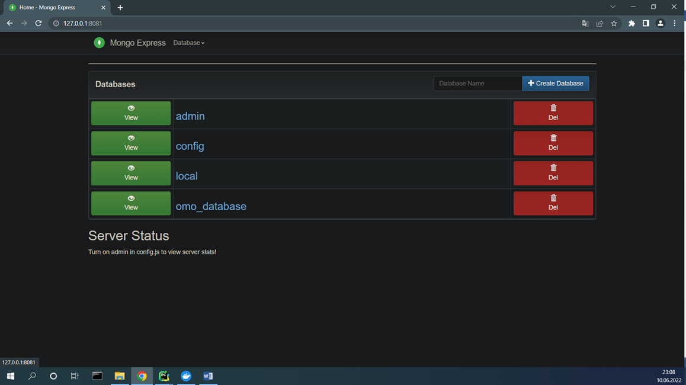
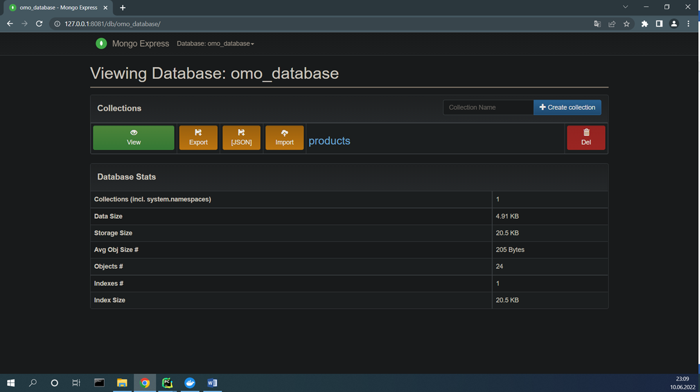
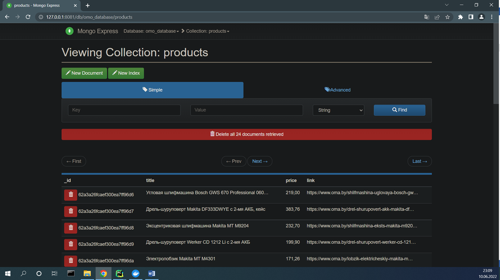

# Scrapy and Mongo (simple example)


```text
   Parsing of goods on the site "https://www.oma.by", saving in csv format.
   (without pagination )
   Converting csv to json.
   Add data(json) to database mongodb.
   Reading data from database mongodb.
```    

   
Requirements:

    scrapy, pymongo, 
    database - mongodb

### install requirements 

```shell
 pip install Scrapy
 pip install pymongo
 
```


## Quick Start use docker

To get this project up and running locally on your computer:
1. git clone 

```shell
#Run all at once

docker-compose up -d --build --force-recreate

```

2. Open a browser to `http://127.0.0.1:8081/` to open the  mongo-express


3. Run spider and save data in data.csv
```text
   scrapy runspider 1_spider.py -o data.csv

```
4. Run 2_convertor_csv_to_json.py


5. Run 3_add_data_to_mongo.py


5. Run 4_load_data_from_mongo.py


### If there is problem with character encoding use - ensure_ascii=False

```text
jsonString = json.dumps(jsonArray, indent=4, ensure_ascii=False)

```

1. Mongo express

   
   
2. database

   

3. collection 

   


